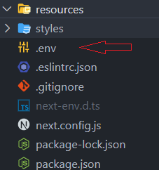
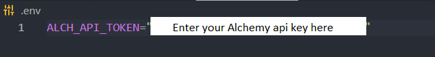

## Getting Started

First, install all the required dependecies by running:

```bash
npm install

```

Then, Create a .env file in root folder



write your Alchemy Api key in the .env file



Lastly, run the development server:

```bash
npm run dev

```

Open [http://localhost:3000](http://localhost:3000) with your browser to see the result.
